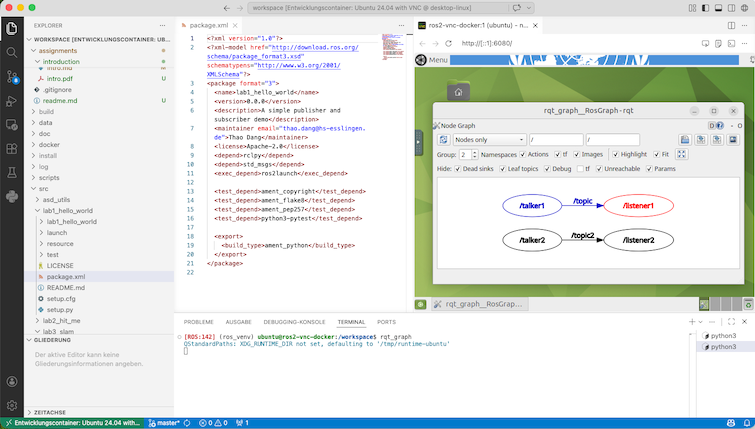

# Labortermin 1: Entwickeln mit ROS

Thao Dang 2026, Hochschule Esslingen 



Der erste Labortermin besteht aus vier Aufgaben, die aufeinander aufbauen und grundlegend für die nächsten Termine sind:

- Aufgabe 1: Checken Sie Ihr Repository auf einem Laborrechner aus und starten Sie die Entwicklungsumgebung in einem Docker-Container in Visual Studio Code.

- Aufgabe 2: Erstellen Sie zwei einfache Publisher- und Subscriber-Nodes mit ROS 2.

- Aufgabe 3: Generieren Sie Launch-Files für diese beiden Nodes.

- Aufgabe 4: Starten Sie eine TurtleBot-Simulation und visualisieren Sie die Sensordaten des Roboters mit rviz.

Die Abgabe für das Labor ist ein Feature-Branch ``lab1_hello_world`` und ein Pull Request für Ihr Repository mit den Lösungen der Aufgaben 2 bis 4. Teil des Pull Requests soll auch eine Markdown-Datei sein, in der Sie die Ergebnisse der Aufgaben 2 bis 4 **kurz** dokumentieren.

----

## Aufgabe 1: Entwicklungsumgebung

### Aufgabe 1.1: Repository auschecken

Auf einem Rechner im Labor bietet sich für den Zugang zu GitHub ein Personal Access Token mit zeitlich beschränkter Gültigkeit an. Um ein solches zu bekommen, führen Sie folgende Schritte aus:
- Bei GitHub.com einloggen
- Auf das Profilsymbol oben rechts klicken, dann Einstellungen auswählen
- Links unten (ganz unten): Developer Settings
- Personal Access Tokens aufklappen, dann Classic auswählen
- Namen festlegen, Repo auswählen
- Token generieren und sofort irgendwo sichern – er wird danach nicht mehr angezeigt
- Ein Terminal öffnen:
```bash
mkdir -p projects # fuer Ihre Repos
mkdir -p data # fuer Ihre Messdaten 
cd projects
git clone https://github.com/Ihr-Privates-Repo.git
```
Bei "Username" den GitHub-Benutzernamen und bei "Password" das erzeugte PAT eingeben.

Der nächste Schritt hängt davon ab, ob Sie auf dem Laborrechner (Linux mit GPU, Docker etc. vorinstalliert) oder auf einem eigenen Rechner arbeiten. Die Installation auf dem Laborrechner muss durchgeführt werden (siehe Aufgabe 1.2A), die Installation auf einem eigenen Rechner ist empfohlen, aber nicht verpflichtend (siehe Aufgabe 1.2B).

### Aufgabe 1.2A: Entwicklungsumgebung auf dem Laborrechner (Linux-Rechner mit GPU)

1. Starten Sie VS Code, entweder über das Anwendungsmenü oder über die Kommandozeile:
    ```bash
    cd Ihr-Privates-Repo
    code .
    ```

2. Die Entwicklungsumgebung wurde so konzipiert, dass sie über Docker unabhängig vom Betriebssystem mit grafischer Oberfläche funktionsfähig ist (siehe Aufgabe 1.2B). Für die Labor-PCs ist allerdings eine Anpassung der Konfiguration nötig, um die Netzwerk-Ports für die TurtleBots freizugeben, die GPU zu aktivieren und die grafische Oberfläche des Ubuntu-PCs nativ zu nutzen. Ändern Sie dazu in ``.devcontainer/devcontainer.json``:
    ```bash
        "runArgs": [
            "--hostname=ros2-vnc-docker",
            "--shm-size=512m",
            "--init",
            "--network", << added
            "host",      << added
            ...
        ],
    ```
    ("<< added" zeigt an, welche Zeilen hinzugefügt werden müssen. Den Kommentar "<< added" bitte nicht übernehmen.)

    Für die grafische Oberfläche ändern Sie die DISPLAY-Umgebungsvariable in ``.devcontainer/devcontainer.json``:
    ```bash
        "containerEnv": {
            "DISPLAY": "${localEnv:DISPLAY}"
        }
    ```

3. Aktivieren Sie die GPU in ``devcontainer.json``, indem Sie die Zeile 
   ```bash
   "image": "tdcode/asd-turtlebot4-docker:latest", 
   ```
   ersetzen durch
   ```bash
   "image": "tdcode/asd-turtlebot4-docker:gpu", 
   ```
   Fügen Sie außerdem folgende Zeilen hinzu:
   ```bash
       "runArgs": [
        ...
        "-v",
        "./docker/bash:/home/ubuntu/bash",
        "--runtime=nvidia",                         << added
        "--gpus",                                   << added
        "all",                                      << added
        "--volume",                                 << added
        "/usr/local/cuda-12.8:/usr/local/cuda-12.8" << added
        ...
    ],
   ```

4. Drücken Sie die Taste "F1" und geben Sie "Dev Containers: Rebuild and Reopen Container" ein. Führen Sie den Befehl aus. Der Container wird heruntergeladen und gestartet (das kann beim ersten Mal einige Minuten dauern).

    Hinweis: Es kann sein, dass das Paket "Dev Containers" in VS Code noch nicht installiert ist. Installieren Sie das Paket dann über die Erweiterungen in VS Code (siehe [hier](https://github.com/td-code/asd-turtlebot4-solution/blob/master/doc/docs/howToVNC.md#install-devcontainer)).

5. Nachdem der Container gestartet ist, öffnen Sie in VS Code ein neues Terminal. Dies sollte in etwa folgende Ausgabe zeigen:
    ```bash
    To run a command as administrator (user "root"), use "sudo <command>".
    See "man sudo_root" for details.

    [ROS:142] (ros_venv) ubuntu@ros2-vnc-docker:/workspace$ ls
    LICENSE  README.md  scripts  src
    ```
    Ihr Benutzername ist "ubuntu" und das Passwort ebenfalls "ubuntu". 

6. Um den Container zu testen, starten Sie im Terminal in VS Code ``xeyes``:
    ```bash
    [ROS:142] (ros_venv) ubuntu@ros2-vnc-docker:/workspace$ xeyes
    ```
    Dies sollte ein Fenster mit Augen öffnen, die dem Mauszeiger folgen.

    Sobald ``xeyes`` funktioniert, können Sie direkt zu Aufgabe 1.3 springen oder die Entwicklungsumgebung auch noch auf Ihrem eigenen Rechner installieren (Aufgabe 1.2B). Weitere Details zur Installation auf dem Laborrechner finden Sie bei Bedarf unter [real_turtlebot](https://github.com/td-code/asd-turtlebot4-base/blob/master/doc/docs/real_turtlebot.md).

### Aufgabe 1.2B: Entwicklungsumgebung auf eigenem Rechner mit Windows, MacOS oder Linux (optional)

Auf Ihrem eigenen Rechner müssen Sie zunächst Docker und VS Code installieren und dann die Entwicklungsumgebung in einem DevContainer starten. Folgen Sie dazu der Anleitung [howToVNC](https://github.com/td-code/asd-turtlebot4-base/blob/master/doc/docs/howToVNC.md) bis zum Test mit xeyes.

### Aufgabe 1.3: Erzeugen eines Feature-Branch

Bereiten Sie den Feature-Branch für das erste Labor vor:
```bash
cd <Ihr-Privates-Repo>
mkdir -p src
source /opt/ros/jazzy/setup.bash
colcon build --merge-install --symlink-install --cmake-args "-DCMAKE_BUILD_TYPE=Release"
source install/setup.bash 

git branch lab1_hello_world
git checkout lab1_hello_world
```

Diesen Feature-Branch sollen Sie in diesem Labor verändern und schließlich hochladen.

## Aufgabe 2: Publisher/Subscriber

Erzeugen Sie zunächst ein Publisher-/Subscriber-Beispiel in vier Schritten:
1. Erzeugen Sie ein Paket mit Namen ``lab1_hello_world`` im ``src``-Verzeichnis.
2. Schreiben Sie einen Publisher-Node ``talker.py`` und verstehen Sie den Code.
3. Schreiben Sie einen Subscriber-Node ``listener.py`` und verstehen Sie den Code.
4. Bauen Sie den Code und führen Sie die beiden Nodes in zwei verschiedenen Terminals aus.

Für alle obigen Aufgaben folgen Sie dem [Publisher-Subscriber-Tutorial für ROS 2 Jazzy](https://docs.ros.org/en/jazzy/Tutorials/Beginner-Client-Libraries/Writing-A-Simple-Py-Publisher-And-Subscriber.html) (bis auf die abweichenden Namen der Nodes und des Pakets).

Den Build-Prozess können Sie aber etwas einfacher als im Tutorial ausführen. Starten Sie einfach in einem Terminal:
```bash
cd /workspace && colcon build --merge-install --symlink-install --cmake-args "-DCMAKE_BUILD_TYPE=Release"
source /workspace/install/setup.bash
```
und führen Sie dann z. B. ``ros2 run lab1_hello_world talker`` aus.

Nachdem Sie die beiden Nodes erfolgreich starten konnten, analysieren Sie die laufenden Prozesse und die Kommunikation. Testen Sie in einem dritten Terminal folgende ROS-2-Befehle und machen Sie sich klar, was die einzelnen Befehle tun:
```bash
source install/setup.bash 
rqt_graph 
ros2 topic list
ros2 topic info /topic
ros2 topic echo /topic
ros2 topic hz /topic
```

## Aufgabe 3: Launch-Files

### Aufgabe 3.1: Einfache Launch-Files

Starten Sie nun beide Nodes gleichzeitig mit einem geeigneten Launch-File:
```bash
cd /workspace/src/lab1_hello_world/
mkdir -p launch
``` 
Erstellen Sie die Launch-Datei ``launch/chatter_launch.xml`` mit folgendem Inhalt:
```bash
<?xml version="1.0" encoding="UTF-8"?>
<launch>
<node pkg="lab1_hello_world" exec="talker" ros_args="--log-level warn" />
<node pkg="lab1_hello_world" exec="listener" ros_args="--log-level info" />
</launch>
```
Passen Sie ``setup.py`` an (**sowohl** ``imports`` als auch ``data_files``):
```bash
import os
from glob import glob
from setuptools import find_packages, setup
...
    data_files=[
        ('share/ament_index/resource_index/packages',
            ['resource/' + package_name]),
        ('share/' + package_name, ['package.xml']),
        # Include all launch files:
        (os.path.join('share', package_name, 'launch'), glob('launch/*')),  
    ],
```
und ergänzen Sie in ``package.xml``:
```bash
<exec_depend>ros2launch</exec_depend>
```
Starten Sie das Launch-File und ändern Sie die Log-Level, um Debug-Meldungen von Talker und Listener zu sehen:
```bash
cd /workspace && colcon build --merge-install --symlink-install --cmake-args "-DCMAKE_BUILD_TYPE=Release"
source install/setup.bash 
ros2 launch lab1_hello_world chatter_launch.xml
```

### Aufgabe 3.2: Launch-Files und Remapping

Starten Sie nun jeweils zwei Talker und Listener:
Erstellen Sie die neue Launch-Datei ``launch/doublechatter_launch.xml`` mit folgendem Inhalt:
```bash
<?xml version="1.0" encoding="UTF-8"?>
<launch>
<node pkg="lab1_hello_world" exec="talker" name="talker1" ros_args="--log-level info" />
<node pkg="lab1_hello_world" exec="listener" name="listener1" ros_args="--log-level info" />

<node pkg="lab1_hello_world" exec="talker" name="talker2" ros_args="--log-level info" />
<node pkg="lab1_hello_world" exec="listener" name="listener2" ros_args="--log-level info" />
</launch>
```
Starten Sie die Nodes und visualisieren Sie sie mit ``rqt_graph``. Das Ergebnis ist zunächst chaotisch.
Ändern Sie nun ``launch/doublechatter_launch.xml`` wie folgt:
```bash
<?xml version="1.0" encoding="UTF-8"?>
<launch>
<node pkg="lab1_hello_world" exec="talker" name="talker1" ros_args="--log-level info" />
<node pkg="lab1_hello_world" exec="listener" name="listener1" ros_args="--log-level info" />

<node pkg="lab1_hello_world" exec="talker" name="talker2" ros_args="--log-level info">
    <remap from="/topic" to="/topic2" />
</node>
<node pkg="lab1_hello_world" exec="listener" name="listener2" ros_args="--log-level info">
    <remap from="/topic" to="/topic2" />
</node>
</launch>
```
Starten Sie erneut und visualisieren Sie mit ``rqt_graph``. Was ist passiert?

## Aufgabe 4: Simulation TurtleBot

Für die Simulation des TurtleBots brauchen Sie die Publisher und Subscriber nun nicht mehr. Starten Sie die Simulation und die Visualisierung mit rviz2 entsprechend der Anleitung in [simulation.md](https://github.com/td-code/asd-turtlebot4-base/blob/master/doc/docs/simulation.md).

Führen Sie dann folgende Aufgaben aus:
1. Zeigen Sie alle laufenden Nodes und Kommunikationspfade mit ``rqt_graph`` an.
2. Visualisieren Sie LiDAR-Scan und Kamerabild in rviz2 mit ``Add -> By Topic``.
3. Geben Sie die Scan-Message auf der Konsole aus. Welche Felder hat die Nachricht?
4. Bewegen Sie den TurtleBot, indem Sie über die Kommandozeile eine entsprechende Nachricht senden:
    ```bash
    ros2 topic pub /cmd_vel geometry_msgs/msg/TwistStamped \
    "twist:
    linear:
        x: 0.0
        y: 0.0
        z: 0.0
    angular:
        x: 0.0
        y: 0.0
        z: 0.0"
    ```
Wie dreht man den TurtleBot?

## Abschluss des Labors (für jeden Labortermin gleich) 

Der Abschluss des Labors ist für alle Labortermine gleich und wird bei den nächsten Assignments nicht mehr explizit beschrieben:

1. Erstellen Sie ein kurzes ``README.md`` in Ihrem aktuellen Package-Verzeichnis. Das README sollte Ihre Ergebnisse kurz beschreiben und darstellen, wie Ihr Code auszuführen ist. Hilfreich sind hierfür Codeblöcke in Markdown, z.B.:
````{verbatim}
```bash
cd /workspace
colcon build --merge-install --symlink-install --cmake-args "-DCMAKE_BUILD_TYPE=Release"
```
````

2. Committen Sie den aktuellen Stand in Ihrem Branch und pushen Sie den Branch:
```bash
git push -u origin <ihr-branch-name>
```

3. Besuchen Sie Ihr Repository auf github.com und erstellen Sie einen [Pull Request](https://docs.github.com/de/pull-requests/collaborating-with-pull-requests/proposing-changes-to-your-work-with-pull-requests/creating-a-pull-request?tool=webui#creating-the-pull-request).

4. Bitten Sie die Laboraufsicht, den Pull Request zu genehmigen. **Achtung**: Der Merge des Pull Requests soll nur durch den Laborbetreuer erfolgen.

5. (Vor dem nächsten Termin:) Wechseln Sie auf den aktuellen Hauptbranch und erstellen Sie von dort den neuen Branch für den nächsten Labortermin:
```bash
git checkout master
git pull
git checkout -b <ihr-neuer-branch>
```

