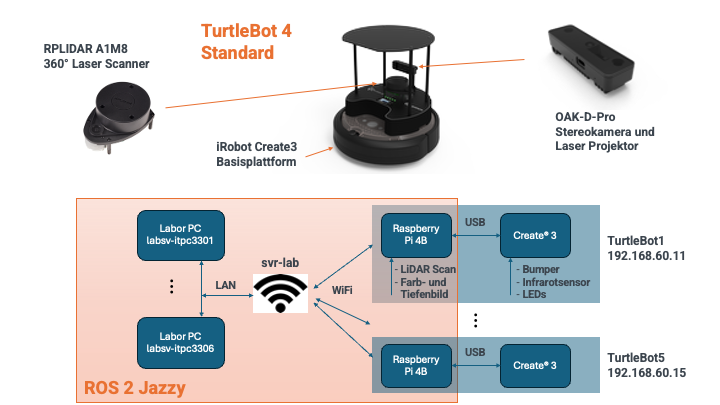

# Labortermin 2: Steuern des Turtlebots

Thao Dang 2026, Hochschule Esslingen 

Im letzten Labortermin haben Sie die Grundzüge von ROS kennengelernt und einen Roboter in der Simulation angesteuert. Heute geht es um die Steuerung eines echten Roboters.

Das Labor ist folgendermaßen aufgeteilt:

- Aufgabe 1: Netzwerkverbindung mit dem TurtleBot und Teleoperation.

- Aufgabe 2: HitMe in Simulation.

- Aufgabe 3: HitMe am realen TurtleBot.

Die Abgabe für das Labor ist ein Feature-Branch ``lab2_hit_me`` und ein Pull Request für Ihr Repository mit den Lösungen der Aufgaben. Teil des Pull Requests soll auch eine Markdown-Datei sein, in der Sie Ihre Ergebnisse **kurz** dokumentieren. Der Merge des Pull-Requests soll durch den Laborbetreuer erfolgen!

----

## Aufgabe 1: Netzwerkverbindung mit dem TurtleBot und Teleoperation

Die folgende Abbildung zeigt die TurtleBots und ihre Vernetzung im Labor Signalverarbeitung und Robotik:



Alle Roboter und alle Labor-PCs sind im selben physischen Netzwerk verbunden. Es ist deshalb zweckmäßig, für jeden Roboter und den zugehörigen ansteuernden Labor-PC eine eigene ROS2-Netzwerkumgebung einzurichten und diese voneinander zu isolieren. So können mehrere Gruppen von ROS2-Knoten im selben Netzwerk (z.B. WLAN oder Ethernet) betrieben werden, ohne dass sie sich gegenseitig stören.

Realisiert wird die Trennung über die Umgebungsvariable ``ROS_DOMAIN_ID``. Diese wird vom DDS-Middleware-System (Data Distribution Service) in ROS2 genutzt, um UDP-Ports für Knoten-Discovery und Kommunikation zu berechnen. Das Setzen erfolgt z.B. über das Shell-Kommando
```bash
export ROS_DOMAIN_ID=11
```
Für das Labor wurde dazu ein Shell-Skript [enable_turtlebot.sh](https://github.com/td-code/asd-turtlebot4-base/blob/master/scripts/enable_turtlebot.sh) erstellt, das zusätzlich weitere Kommunikationsparameter initialisiert. Aufruf:
```bash
source scripts/enable_turtlebot.sh 11
```
In der Shell wird dann die aktuelle ROS_DOMAIN_ID zu Beginn jedes Prompts angezeigt:
```bash
[ROS:11] (ros_venv) ubuntu@ros2-vnc-docker:/workspace$ 
```
Achten Sie darauf, dass Sie jeden ROS-Befehl immer mit der richtigen ROS_DOMAIN_ID starten. Dies muss in jedem neuen Terminal zu Beginn gesetzt werden.

Führen Sie nun folgende Schritte aus:
1. Wählen Sie einen Roboter aus und loggen Sie sich aus dem Devcontainer wie im ersten Labor auf dem TurtleBot ein (User: ubuntu, Passwort: turtlebot4). Beispiel für TurtleBot1:
  ```bash
  ssh ubuntu@192.168.60.11
  ```

2. Setzen Sie in einem zweiten Terminal auf dem Labor-PC dieselbe ROS_DOMAIN_ID. Vergewissern Sie sich, dass sowohl auf dem Labor-PC als auch auf dem Raspberry Pi des TurtleBots dieselben Topics angezeigt werden. Prüfen Sie dazu, ob in beiden Terminals die Ausgabe von
  ```bash
  ros2 topic list
  ```  
  dieselben Topics zeigt.

3. Betrachten Sie als Nächstes in rviz2 die Sensordaten des realen Roboters. Starten Sie rviz2 mit
  ```bash
  ros2 launch turtlebot4_viz view_model.launch.py
  ```
  und zeigen Sie einen Live-Feed des LiDAR-Scans und des Kamerabilds an.

4. Bewegen Sie nun wie beim letzten Mal in der Simulation den realen TurtleBot. Senden Sie dazu über die Kommandozeile eine Nachricht wie diese:
  ```bash
  ros2 topic pub /cmd_vel geometry_msgs/msg/TwistStamped "twist:
    linear:
      x: 0.25
      y: 0.0
      z: 0.0
    angular:
      x: 0.0
      y: 0.0
      z: 0.0" 
  ```

5. Sie können den TurtleBot auch mit der Tastatur oder einem Controller teleoperieren. Starten Sie dazu in einem Terminal:
  ```bash
  ros2 run teleop_twist_keyboard teleop_twist_keyboard --ros-args -p stamped:=true
  ```
  Weitere Informationen zum Fahren des Roboters finden Sie im [Driving Tutorial](https://turtlebot.github.io/turtlebot4-user-manual/tutorials/driving.html).

## Aufgabe 2: HitMe in Simulation

Ihre Aufgabe ist nun, den TurtleBot so anzusteuern, dass er sich immer auf das nächste Hindernis in seiner Umgebung zubewegt. Dazu soll er den LiDAR-Scan auswerten und den nächsten erfassten Scanpunkt bestimmen. Anschließend soll er sich in Richtung dieses Punktes bewegen, bis er eine Distanz von ``d_min = 30 cm`` erreicht. Wird diese Distanz unterschritten, soll der Roboter stehen bleiben. Wird das Hindernis entfernt und übersteigt die Distanz zum nächsten Objektpunkt wieder ``d_min``, soll sich der Roboter wieder in Richtung des nächsten Hindernisses bewegen.

Wichtig bei der Entwicklung einer solchen Applikation sind gute Möglichkeiten zum Debugging:
1. Deshalb entwickeln Sie die Applikation zunächst in der Simulation. 
2. Außerdem sollen Sie den erfassten nächsten Scanpunkt (auf den sich der Roboter zu bewegen soll) in rviz2 visualisieren, um Ihren Node besser überprüfen zu können. 
3. Nutzen Sie auch die Logger-Funktionalität, um Debug-Nachrichten zu erzeugen, z.B. wie im letzten Labor:
  ```bash
  self.get_logger().info('I heard: "%s"' % msg.data)
  ```

Zur Aufgabe:

1. Erzeugen Sie ein Package ``lab2_hit_me`` im Verzeichnis ``/workspace/src`` (siehe letztes Labor).

2. In [hit_me.py](https://gist.github.com/td-code/e9eceda78c1c87ef49820726c7ab8039) finden Sie eine Vorlage, die Sie als Grundgerüst für den Node verwenden können. Kopieren Sie diese Vorlage in Ihr neues Paket unter ``lab2_hit_me/lab2_hit_me/hit_me.py``.

3. Starten Sie eine einfache Simulation:
  ```bash
  # 1st terminal
  ros2 launch turtlebot4_gz_bringup turtlebot4_gz.launch.py world:=simple_world
  ```
  In Gazebo können Sie Objekte auch während der Simulation manuell bewegen. Laden Sie dazu zunächst über die drei Punkte oben rechts das "SelectEntities"-Plugin. Ist dieses Plugin geladen, können Sie ein Objekt selektieren (Pfeilsymbol) und dann entlang der Koordinatenachsen verschieben (Doppelpfeilsymbol). 

  **ACHTUNG:** Wenn Sie die Simulation starten, dürfen Sie nicht in der ``ROS_DOMAIN_ID`` des TurtleBots sein, sondern verwenden die auf dem Rechner standardmäßig gesetzte ID.

4. Programmieren Sie in ``hit_me.py`` die Suche nach dem nächsten LiDAR-Scanpunkt. Berechnen Sie daraus auch die Entfernung und den Winkel zum nächsten Hindernispunkt. Erzeugen Sie anschließend einen Marker an der Position des gefundenen nächsten Punktes und visualisieren Sie diesen Marker in rviz2.  <br>
Hilfreich ist dabei die [Definition der empfangenen LaserScan-Message](https://docs.ros.org/en/rolling/p/sensor_msgs/msg/LaserScan.html). Starten Sie zum Test Ihres bisherigen Codes in einem zweiten Terminal rviz2 und in einem dritten Terminal den ``hit_me``-Node:
  ```bash
  # build package
  cd /workspace/ && colcon build --merge-install --symlink-install --cmake-args "-DCMAKE_BUILD_TYPE=Release"
  source install/setup.bash

  # 2nd terminal
  ros2 launch turtlebot4_viz view_model.launch.py

  # 3rd terminal
  source /workspace/install/setup.bash
  ros2 run lab2_hit_me hit_me
  ``` 

5. Programmieren Sie mit Hilfe des zuvor bestimmten Winkels und der Distanz des nächsten Scanpunktes einen einfachen Regelalgorithmus, um einen Steuerbefehl für den Roboter zu berechnen. Der Steuerbefehl ist vom Typ [TwistStamped](https://docs.ros.org/en/rolling/p/geometry_msgs/msg/TwistStamped.html) und wurde in Aufgabe 1 bereits verwendet. <br>
Testen Sie Ihren Algorithmus in der Simulation.

## Aufgabe 3: HitMe am realen TurtleBot

Wenn Ihre Implementierung in der Simulation funktioniert, können Sie HitMe am realen Roboter testen. Setzen Sie dazu wie oben beschrieben die ROS_DOMAIN_ID für Ihren Roboter, starten Sie rviz2 (aber nicht die Simulation!) und anschließend den Node ``hit_me``.

Wie gut funktioniert Ihr Regelalgorithmus? Verbessern Sie ihn falls erforderlich.

Fassen Sie Ihre Ergebnisse in einer Readme-Datei in Ihrem Package zusammen. Ggf. können Sie auch ein Video einer Fahrt erstellen (bitte nicht in das Repository aufnehmen, damit dieses nicht unnötig groß wird). Erstellen Sie anschließend einen Pull Request.

Falls die Zeit es erlaubt, können Sie zusätzlich eine Messung einer Fahrt aufnehmen und anschließend wieder abspielen, siehe [rosbag record/play Tutorial](https://docs.ros.org/en/jazzy/Tutorials/Beginner-CLI-Tools/Recording-And-Playing-Back-Data/Recording-And-Playing-Back-Data.html). Sie können die Messung im Verzeichnis ``/workspace/data`` ablegen.


