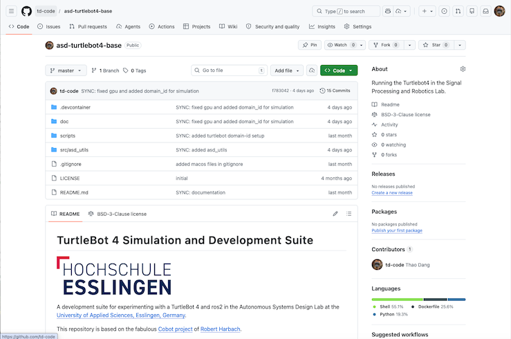

# Labor Autonomous Systems Design - Einführung

Thao Dang 2026, Hochschule Esslingen 



Ziel des Labors Autonomous Systems Design (ASD) ist es, die Entwicklung von Robotik-Applikationen in Simulation und am echten Roboter, das Arbeiten mit ROS 2 (Robot Operating System 2) und die Verwendung von Entwicklungswerkzeugen wie git und Docker an einigen Beispielen zu demonstrieren. Dazu werden einige Laborversuche durchgeführt, die in nachfolgenden Dokumenten beschrieben werden. Zuvor sollen hier aber zunächst ein paar generelle Hinweise und eine Anleitung zur Vorbereitung vor dem ersten Labor gegeben werden.

## Allgemeine Hinweise zur Durchführung des Labors

- Das Labor findet in Gruppen von bis zu drei Personen statt. Zu den Laborterminen gibt es Aufgabenbeschreibungen und evtl. Vorbereitungsaufgaben. Es wird erwartet, das jeder Teilnehmer die Aufgabenbeschreibungen gelesen hat und Fragen zu dieser beantworten kann. Vorbereitungsaufgaben müssen (pro Gruppe) durchgeführt worden sein. **Ohne entsprechende Vorbereitung kann eine Gruppe nicht am jeweiligen Labortermin teilnehmen.**
  
- Es gilt eine Anwesenheitspflicht. Wer unentschuldigt fehlt, muss das Labor im nächsten Semester wiederholen.

- Die Dokumentation und die Abgaben zum Labor finden über ein github Repository statt. Beachten Sie dazu bitte das Kapitel [Vor dem ersten Labor](#vor-dem-ersten-labor). 

- Pro Termin wird ein **kurzer Bericht** erwartet, der am besten im als Readme im Markdown-Format in Ihrem Repository gespeichert werden sollte. Beschreiben Sie darin kurz, was Sie implementiert haben, wie Sie Ihre Implementierung getestet haben (wo sinnvoll gerne auch mit Screenshots oder Video‑Links) und was Ihre "Lessons learned" aus dem Labortermin sind. Besprechen Sie den Bericht am Ende des Labortermins oder zu Beginn des nächsten Labortermins kurz mit der Laboraufsicht. Der Bericht muss nicht sehr umfangreich sein, sondern dient hauptsächlich dazu, dass Sie auch noch mit einigem Abstand Ihre Ergebnisse reproduzieren können sollen und die wichtigsten Inhalte des Labors kurz zusammenfassen. 

- Verwenden Sie **pro Termin einen neuen Branch in git und stellen Sie einen Merge-Request**. Der Merge sollte dann erst nach der Durchsprache des Berichts mit der Laboraufsicht gemerged werden.


## Vor dem ersten Labor

Für das Labor werden Sie git und github verwenden. Sollten Sie git noch nicht verwendet haben oder eine Auffrischung benötigen, können Sie sich z.B. mit Hilfe des [Cheatsheets](https://education.github.com/git-cheat-sheet-education.pdf) oder des [gittutorial](https://git-scm.com/docs/gittutorial) oder auch irgendeinem anderen Tutorial informieren. Wichtig sind in diesem Labor aber lediglich grundlegende Konzepte wie lokale Repositories (git init, git clone), Staging & Commit (git add, git commit), 
Remote Repositories (git push, git pull) und 
Branching (git branch, git merge).

Sie benötigen dazu auch einen kostenfreien github-Account und zum einfachen Arbeiten am besten auch [ssh keys für den Zugang](https://docs.github.com/en/authentication/connecting-to-github-with-ssh/generating-a-new-ssh-key-and-adding-it-to-the-ssh-agent).

Für das Labor wurde ein Basis-Repository erstellt. Bitte kopieren Sie dieses Repository und machen daraus wie unten erklärt ein privates Repository für jede Laborgruppe. Nur die Mitglieder Ihrer Gruppe und die Laboraufsicht sollten auf das Repository Zugang haben (den Zugang für die Laboraufsicht erstellen wir am ersten Termin). **Wichtig: erstellen Sie keinen Fork des Repositories, da Ihre Ergebnisse zumindest während des Verlauf des Labors privat und nicht öffentlich sein sollen!**  

Das Kopieren des Repositories verläuft wie folgt (**nur einmal pro Gruppe ausführen**):

1. Loggen Sie sich mit Ihrem User auf [github](https://github.com/) ein.

2. Klicken Sie auf das „+“ oben rechts, wählen Sie „Import repository“, geben Sie die Quell-URL ein: 
    ```bash
    https://github.com/td-code/asd-turtlebot4-base
    ``` 
    legen Sie einen Namen für Ihre Kopie fest und setzen sie die Sichtbarkeit Ihres Projekts auf  
    ```bash
    Private
    ```
    (nicht ``Public``). 

3. Alle Mitglieder der Laborgruppe zum Repository einladen: auf der github-Seite Ihres Repositories auf Settings > Collaborators (im Abschnitt "Access") > Personen hinzufügen.

Jedes Gruppenmitglied sollte dann noch folgende Schritte ausführen:

1. Installieren Sie git und richten es auf Ihrem Rechner ein (abhängig von Ihrem Betriebssystem).

2. Checken Sie das Repository auf Ihrem eigenen Rechner aus. Es bietet sich an, als Entwicklungsumgebung [Visual Studio Code](https://code.visualstudio.com/) zu verwenden, zumal wir später Docker und Devcontainer verwenden werden.  

3. Machen Sie sich damit vertraut, wie man Feature Branches erstellt und verwaltet, z.B. [git feature branch workflow](https://www.atlassian.com/git/tutorials/comparing-workflows/feature-branch-workflow). Arbeiten Sie für jedes Labor-Assignment auf einem neuen Branch (z.B. auf einem Branch ``lab1_hello_world``).  

4. Optional: Richten Sie einen Docker-Container auf Ihrem eigenen PC ein, indem Sie der [Quickstart-Anleitung](https://github.com/td-code/asd-turtlebot4-base/blob/master/doc/docs/quickstart.md) und dem [VNC-Setup](https://github.com/td-code/asd-turtlebot4-base/blob/master/doc/docs/howToVNC.md) in Ihrem Repo folgen. Beide Schritte wird Ihre Gruppe auch im ersten Labortermin auf einem Laborrechner ausführen. 


